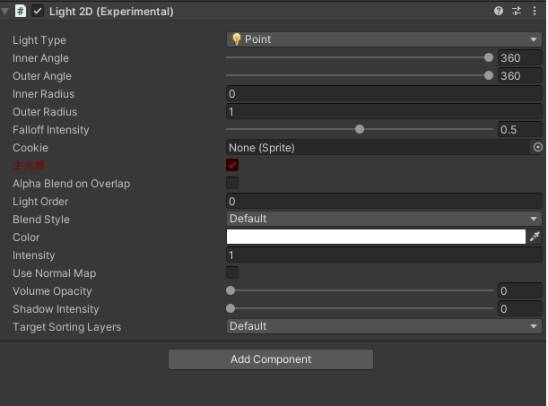
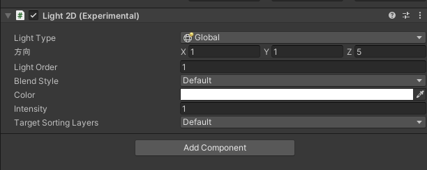
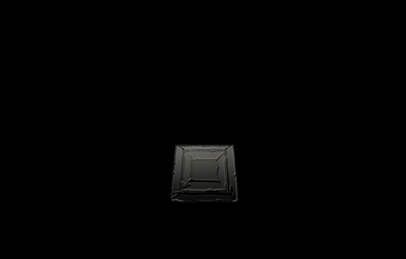
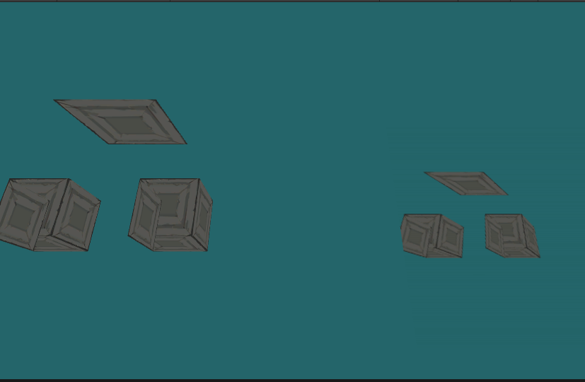
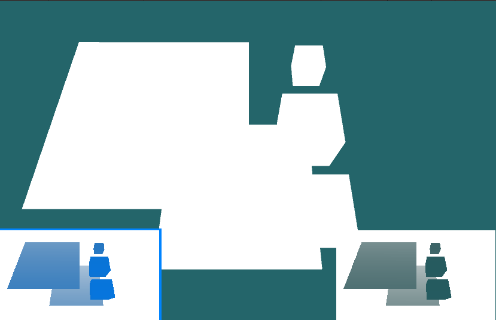
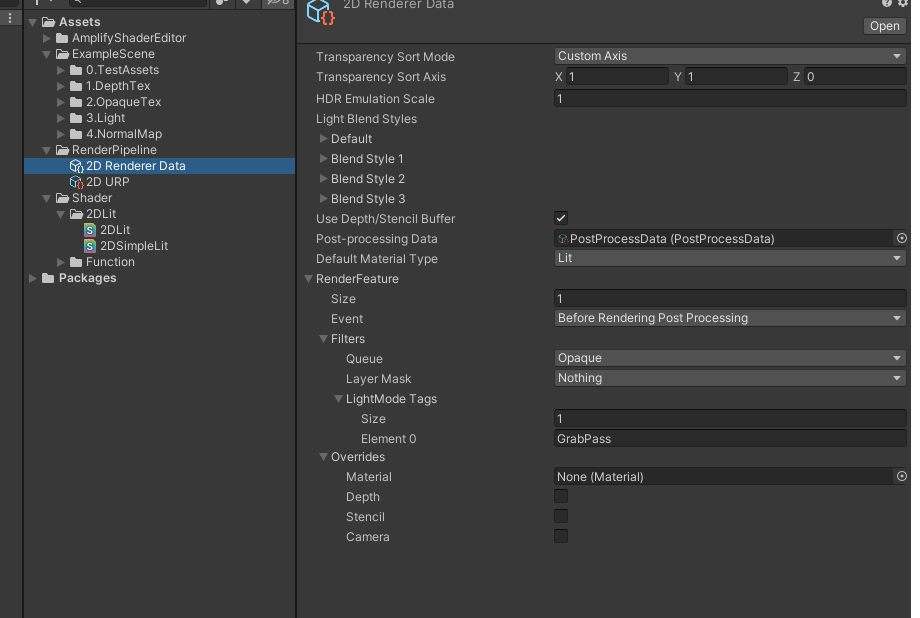

# BDFramework.Urp2dEx
Urp2dEx 
2D管线修改版本，让其能够用于正常项目开发 基于@7.5.1  
Shader部分用AmplifyShaderEditor 1.8.8编写，请自行购买下载 
## 修改日志:  
### 灯光:  
1.制定主光源规范  
2.增加方向光  
3.修复若干bug..  
### 管线:  
1.修复NormalMap,透视相机、相机Rotation变化 下计算出错 
2.实现_2dCameraOpaqueTex   
3.实现_2dCameraDepthTex  
4.实现RenderFeature
5.修复若干bug...

### 主光源：  
   
### 方向光：  
   
### 法线图
   
### GrabPass：
  
### 深度图：  
  
### RenderFeature：
  
 
